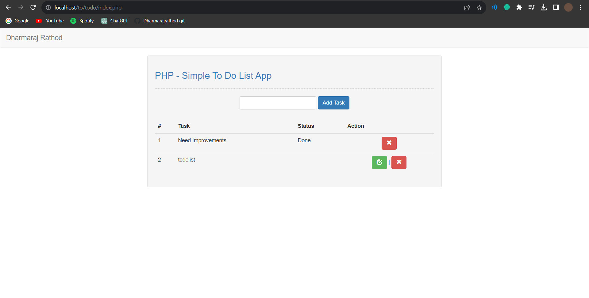

# To-Do List Web App

Effortlessly manage your tasks with the To-Do List Web App, powered by PHP and designed to enhance your task organization and productivity.

## Features

- **Task Management**: Add new tasks to your list, edit existing tasks, and mark tasks as completed.
- **User-Friendly Interface**: The intuitive interface makes it easy to manage your tasks without any learning curve.
- **Real-Time Updates**: See your changes in real time as you add, edit, or complete tasks.
- **Stay Organized**: Keep track of your to-do list and prioritize tasks effectively.
- **Responsive Design**: Access your to-do list from any device, whether it's your desktop, tablet, or smartphone.

## Screenshots

## Getting Started

1. **Clone the Repository**: Use the following command to clone the repository.
git clone https://github.com/Dharmarajrathod/todo-list-php.git

2. **Set Up a Local Server**: Set up a local web server environment using XAMPP, WAMP, MAMP, or any other server stack of your choice.

3. **Copy Project Files**: Copy the cloned project files to your web server's directory.

4. **Access the App**: Open your web browser and navigate to the URL of the app, e.g., `http://localhost/todo-list-php`.

## Contribution

Contributions are welcome! If you encounter issues or have ideas for improvements, feel free to submit issues and pull requests.

## About the Author

This project was created by Dharmaraj Rathod. Connect with me on [GitHub](https://github.com/Dharmarajrathod) for more projects and collaborations.

